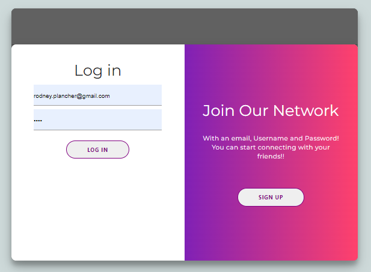

# Not-Into-Gram

Description
This project was created to allow a user to sign up for a Not-Into-Gram user account and participate in social media without the use of ads, suggested reels, spam accounts, and other noise components. After a user signs up for an account, then the user can sign in and view feed post of other user they may be connected to. Users have the ability to like, edit, and delete post. This app will be useful to users who would like a more focused approached to social media. This project uses Javascript, Node, Handlebars,  Html, Firebase,  and Materlize/css. The user must answer each inquirer field to progress and generate the html and css pages.

<h2 dir="auto"><a id="user-content-table-of-contents" class="anchor" aria-hidden="true" href="#table-of-contents"><svg class="octicon octicon-link" viewBox="0 0 16 16" version="1.1" width="16" height="16" aria-hidden="true"><path fill-rule="evenodd" d="M7.775 3.275a.75.75 0 001.06 1.06l1.25-1.25a2 2 0 112.83 2.83l-2.5 2.5a2 2 0 01-2.83 0 .75.75 0 00-1.06 1.06 3.5 3.5 0 004.95 0l2.5-2.5a3.5 3.5 0 00-4.95-4.95l-1.25 1.25zm-4.69 9.64a2 2 0 010-2.83l2.5-2.5a2 2 0 012.83 0 .75.75 0 001.06-1.06 3.5 3.5 0 00-4.95 0l-2.5 2.5a3.5 3.5 0 004.95 4.95l1.25-1.25a.75.75 0 00-1.06-1.06l-1.25 1.25a2 2 0 01-2.83 0z"></path></svg></a>Table of Contents</h2>
<ul dir="auto">
<li><a href="#installation">Installation</a></li>
<li><a href="#usage">Usage</a></li>
<li><a href="#license">License</a></li>
<li><a href="#contributing">Contributing</a></li>
<li><a href="#tests">Tests</a></li>
<li><a href="#questions">Questions</a></li>
</ul>

<h2 dir="auto"><a id="user-content-installation" class="anchor" aria-hidden="true" href="#installation"><svg class="octicon octicon-link" viewBox="0 0 16 16" version="1.1" width="16" height="16" aria-hidden="true"><path fill-rule="evenodd" d="M7.775 3.275a.75.75 0 001.06 1.06l1.25-1.25a2 2 0 112.83 2.83l-2.5 2.5a2 2 0 01-2.83 0 .75.75 0 00-1.06 1.06 3.5 3.5 0 004.95 0l2.5-2.5a3.5 3.5 0 00-4.95-4.95l-1.25 1.25zm-4.69 9.64a2 2 0 010-2.83l2.5-2.5a2 2 0 012.83 0 .75.75 0 001.06-1.06 3.5 3.5 0 00-4.95 0l-2.5 2.5a3.5 3.5 0 004.95 4.95l1.25-1.25a.75.75 0 00-1.06-1.06l-1.25 1.25a2 2 0 01-2.83 0z"></path></svg></a>Installation</h2>
You'll need to install MySQL for the project which instructions can be found at (https://dev.mysql.com/doc/mysql-installation-excerpt/5.7/en/)

After downloading and extracting the project from the zip, open the terminal and install these node packages

npm init -y
npm i dotenv express bcrypt handlebars
npm i mysql2 sequelize express-handlebars express-session
npm i connect-session-sequelize
Make sure to duplicate the .env.EXAMPLE file first, then rename the duplicate as ".env". The user and password in the .env should match your MySQL user and password in order to use the application/ run the server. Also add secret message to the SECRET in env file.

The database needed for the application will need to be set up as well. First, log into MYSQL via the terminal using "mysql -uroot -p". Enter in your password and type in "SOURCE db/schema.sql" when MYSQL is connected to create the techBlog_db database. Exit MYSQL shell by typing in "quit;". Next, start the server by typing "npm start" in the terminal to set up the tables for the database then press CTRL + C and type "Y" to stop the server. After, you will want to populate the database with data via seeding. Type "npm run seed" in the terminal to seed the database. Now the application is ready to be used.

<h2 dir="auto"><a id="user-content-usage" class="anchor" aria-hidden="true" href="#usage"><svg class="octicon octicon-link" viewBox="0 0 16 16" version="1.1" width="16" height="16" aria-hidden="true"><path fill-rule="evenodd" d="M7.775 3.275a.75.75 0 001.06 1.06l1.25-1.25a2 2 0 112.83 2.83l-2.5 2.5a2 2 0 01-2.83 0 .75.75 0 00-1.06 1.06 3.5 3.5 0 004.95 0l2.5-2.5a3.5 3.5 0 00-4.95-4.95l-1.25 1.25zm-4.69 9.64a2 2 0 010-2.83l2.5-2.5a2 2 0 012.83 0 .75.75 0 001.06-1.06 3.5 3.5 0 00-4.95 0l-2.5 2.5a3.5 3.5 0 004.95 4.95l1.25-1.25a.75.75 0 00-1.06-1.06l-1.25 1.25a2 2 0 01-2.83 0z"></path></svg></a>Usage</h2>

Link: https://not-into-gram.herokuapp.com

Initiate the application via web broswer. A user can enter an email address and password for sign up. Once, the user has signed up, they may login to the using their email and password that was used in sign up. Next, the user is taking to the main page, Feeds, where other users images will populate. In feeds, the user can scroll through picutres, like and dislike picutres, or chose to view their own profile. When viewing their own profile, they have the choice to upload and edit photos. Future implementation will allow for adding comments and "swipe" functionality on photos.

<h2 dir="auto"><a id="user-content-license" class="anchor" aria-hidden="true" href="#license"><svg class="octicon octicon-link" viewBox="0 0 16 16" version="1.1" width="16" height="16" aria-hidden="true"><path fill-rule="evenodd" d="M7.775 3.275a.75.75 0 001.06 1.06l1.25-1.25a2 2 0 112.83 2.83l-2.5 2.5a2 2 0 01-2.83 0 .75.75 0 00-1.06 1.06 3.5 3.5 0 004.95 0l2.5-2.5a3.5 3.5 0 00-4.95-4.95l-1.25 1.25zm-4.69 9.64a2 2 0 010-2.83l2.5-2.5a2 2 0 012.83 0 .75.75 0 001.06-1.06 3.5 3.5 0 00-4.95 0l-2.5 2.5a3.5 3.5 0 004.95 4.95l1.25-1.25a.75.75 0 00-1.06-1.06l-1.25 1.25a2 2 0 01-2.83 0z"></path></svg></a>License</h2>

<h2 dir="auto"><a id="user-content-contributing" class="anchor" aria-hidden="true" href="#contributing"><svg class="octicon octicon-link" viewBox="0 0 16 16" version="1.1" width="16" height="16" aria-hidden="true"><path fill-rule="evenodd" d="M7.775 3.275a.75.75 0 001.06 1.06l1.25-1.25a2 2 0 112.83 2.83l-2.5 2.5a2 2 0 01-2.83 0 .75.75 0 00-1.06 1.06 3.5 3.5 0 004.95 0l2.5-2.5a3.5 3.5 0 00-4.95-4.95l-1.25 1.25zm-4.69 9.64a2 2 0 010-2.83l2.5-2.5a2 2 0 012.83 0 .75.75 0 001.06-1.06 3.5 3.5 0 00-4.95 0l-2.5 2.5a3.5 3.5 0 004.95 4.95l1.25-1.25a.75.75 0 00-1.06-1.06l-1.25 1.25a2 2 0 01-2.83 0z"></path></svg></a>Contributing</h2>
No contribution necessary for this project.

<h2 dir="auto"><a id="user-content-tests" class="anchor" aria-hidden="true" href="#tests"><svg class="octicon octicon-link" viewBox="0 0 16 16" version="1.1" width="16" height="16" aria-hidden="true"><path fill-rule="evenodd" d="M7.775 3.275a.75.75 0 001.06 1.06l1.25-1.25a2 2 0 112.83 2.83l-2.5 2.5a2 2 0 01-2.83 0 .75.75 0 00-1.06 1.06 3.5 3.5 0 004.95 0l2.5-2.5a3.5 3.5 0 00-4.95-4.95l-1.25 1.25zm-4.69 9.64a2 2 0 010-2.83l2.5-2.5a2 2 0 012.83 0 .75.75 0 001.06-1.06 3.5 3.5 0 00-4.95 0l-2.5 2.5a3.5 3.5 0 004.95 4.95l1.25-1.25a.75.75 0 00-1.06-1.06l-1.25 1.25a2 2 0 01-2.83 0z"></path></svg></a>Tests</h2>
This application can be tested by creating a user account, logging in, and liking/editing or posting pictures to your account.

<h2 dir="auto"><a id="user-content-questions" class="anchor" aria-hidden="true" href="#questions"><svg class="octicon octicon-link" viewBox="0 0 16 16" version="1.1" width="16" height="16" aria-hidden="true"><path fill-rule="evenodd" d="M7.775 3.275a.75.75 0 001.06 1.06l1.25-1.25a2 2 0 112.83 2.83l-2.5 2.5a2 2 0 01-2.83 0 .75.75 0 00-1.06 1.06 3.5 3.5 0 004.95 0l2.5-2.5a3.5 3.5 0 00-4.95-4.95l-1.25 1.25zm-4.69 9.64a2 2 0 010-2.83l2.5-2.5a2 2 0 012.83 0 .75.75 0 001.06-1.06 3.5 3.5 0 00-4.95 0l-2.5 2.5a3.5 3.5 0 004.95 4.95l1.25-1.25a.75.75 0 00-1.06-1.06l-1.25 1.25a2 2 0 01-2.83 0z"></path></svg></a>Questions</h2>

Github: <a href="https://github.com/austin-espinal">Austin Espinal</a>  <a href="https://github.com/Rodney1100">Rodney Plancher</a>  <a href="https://github.com/difrancesco1">Josh Difrancesco</a>  <a href="https://github.com/kiyayoo">Na'Kiya Russell</a> 

If there are any additional questions, please reach out via Github.
